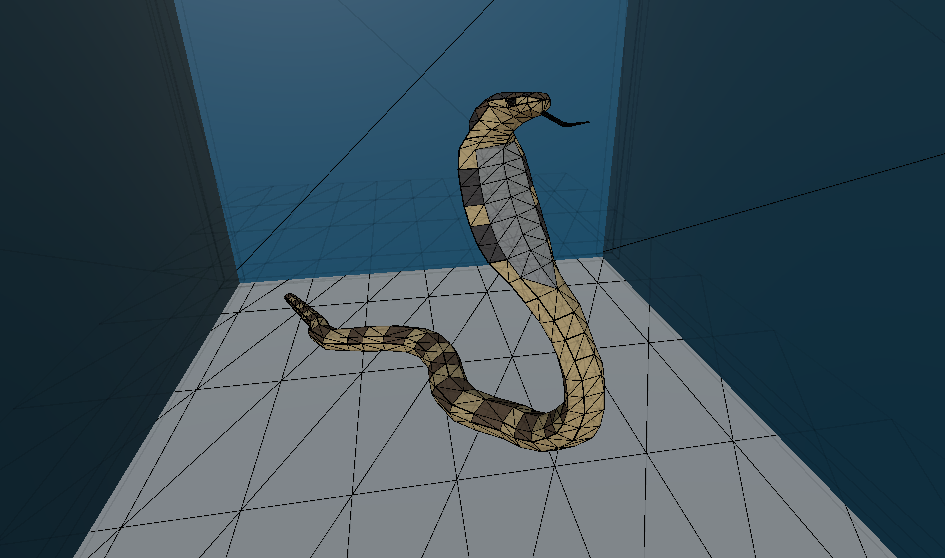

# Unity Ray Tracer

This project is a fully custom ray tracer implemented in Unity using compute shaders. It simulates the physics of light to render realistic scenes from scratch and includes a wide range of techniques commonly used in both academic and production-grade renderers.

Beyond producing physically-inspired visuals, the project also serves as an educational tool. It includes visual debugging utilities to help developers understand ray paths, mesh geometry, and the camera frustum in real-time.

  

---

## Table of Contents

- [Features](#features)
- [How It Works](#how-it-works)
- [Bonus Visualization Tools](#bonus-visualization-tools)
- [Getting Started](#getting-started)
- [Code Structure](#code-structure)
- [Screenshots](#screenshots)
- [License](#license)

---

## Features

### Shading Models and Materials

- **Phong Shading**: Classic specular lighting model with ambient, diffuse, and reflective components.
- **Lambertian Shading**: Used for diffuse materials for a matte, physically plausible look.
- **Metallic and Smoothness Parameters**: Enables materials to exhibit various real-world surface behaviors.
- **Per-pixel Shading**: Shading is performed at sub-pixel resolution using supersampling.

  
   
  <em>Matte pastel-colored spheres rendered with soft shadows and Lambertian shading</em>

### Lighting and Shadows

- **Direct Lighting**: Supports both directional and point lights.
- **Hard Shadows**: Achieved via single shadow rays per light.
- **Soft Shadows**: Area light simulation using multi-sample shadow rays for penumbra effects.

  
   
  <em>Scene featuring both glossy metallic and matte spheres, showcasing material diversity and specular highlights</em>

### Ray Tracing Core

- **Möller–Trumbore Triangle Intersection**: Efficient intersection test for triangle meshes.
- **Multiple Rays per Pixel (Supersampling)**: Reduces aliasing and noise for smooth results.

### Performance and Acceleration

- **Bounding Volume Hierarchy (BVH)**: Built on startup to accelerate ray-mesh intersection.
- **GPU-accelerated Ray Traversal**: All core computation is performed on the GPU using compute shaders.
- **Efficient Memory Layout**: Optimized for structured GPU access via Unity buffers.

---

## How It Works

Each frame, the renderer casts several rays per pixel. Rays intersect with geometry via BVH traversal, and at each hit point, lighting is calculated using surface normals, light positions, visibility (shadows), and material properties. Results are accumulated over multiple frames to reduce noise (progressive sampling).

**Soft Shadows** are computed by randomly sampling within the area light's radius. For each sample, a shadow ray is tested for occlusion. The final visibility is averaged across all shadow rays.

---

## Bonus Visualization Tools

These utilities are available in the project to assist with debugging and educational insights:

- **Camera Frustum Visualizer**: Renders camera frustum corners using compute shader outputs and `Debug.DrawRay`.
- **Ray Visualizer**: Displays rays being cast into the scene.
- **Mesh Triangle Visualizer**: Shows individual triangle geometry for objects in world space.

  

---

## Getting Started

1. Clone or download this repository.
2. Open the project in Unity.
3. Open the main scene.
4. Enter Play Mode — rendering will begin automatically.

You can adjust lighting, material, and rendering parameters directly from the Unity Editor.

---

## Code Structure

- `RayTracingManager.cs`: Main Unity component that builds the scene data, initializes GPU buffers, and dispatches the compute shader.
- `RayTracing.compute`: GPU compute shader that handles ray generation, BVH traversal, shading, and final image output.
- `BVH.cs`: CPU-side BVH construction code (not shown above, but assumed to be present).
- Visualization scripts/files:
  - Frustum buffer setup and debug drawing
  - Ray drawing utility
  - Triangle debug view
